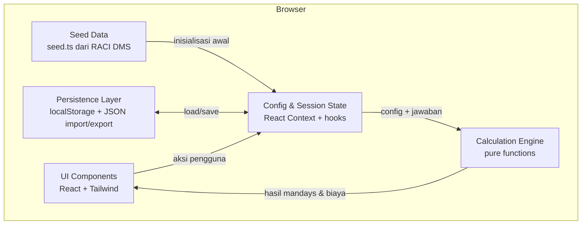

# Arsitektur — Mandays Generator

Dokumen ini menjelaskan arsitektur aplikasi Mandays Generator secara ringkas. Untuk cara setup, run, dan deploy, lihat [README.md](./README.md).

## Ringkasan

Mandays Generator adalah aplikasi web **client-side** (berjalan sepenuhnya di browser) yang membantu Solution Architect menyusun estimasi mandays sebuah project. Tidak ada backend, tidak ada database, dan tidak ada API server. Seluruh state disimpan di memori browser dan dipersist ke `localStorage`, serta dapat di-import/export sebagai file JSON.

Stack: **Next.js (App Router) + React + TypeScript + Tailwind CSS**. Karena state bersifat interaktif dan mengakses `localStorage`, seluruh komponen adalah *client component*.

## Diagram Arsitektur

## Komponen Utama

- **UI Components (`app/`, `components/`)**
  Lapisan tampilan berbasis React + Tailwind. Dua area besar: mode **Estimasi** (stepper: Pilih Task → Kuisioner → Hasil) dan mode **Konfigurasi** yang terbagi menjadi tiga sub-tab: **Task**, **Kuisioner**, dan **Import/Export**. Komponen kunci: `TaskSelector`, `Questionnaire`, `ResultsTable` (termasuk tombol Export CSV di langkah Hasil), `RatePanel`, `ConfigEditor`, `QuestionEditor` (mendukung reorder pertanyaan ↑/↓), `ImportExportPanel`.

- **Config & Session State (`context/ConfigContext.tsx`)**
  Menyediakan state global via React Context, dengan pemisahan penting:
  - **Config (persisted):** definisi kategori, task, variabel, tier, pertanyaan kuisioner, dan rate. Ini adalah aktivitas "admin" dan dipersist ke `localStorage`.
  - **Session (ephemeral):** task yang dipilih dan jawaban kuisioner untuk estimasi saat ini. Ini adalah aktivitas "estimasi" dan hidup di memori.

- **Calculation Engine (`lib/calc.ts`)**
  Kumpulan fungsi murni (tanpa efek samping) yang menghitung hasil dari `config` + `selectedTaskIds` + `answers`. Menghasilkan mandays per task, agregasi per kategori-per-level, total per level, grand total, serta biaya (bila rate diisi). Karena murni, engine ini mudah diuji dan reaktif.

- **Persistence Layer (`lib/persistence.ts`, `lib/validation.ts`)**
  Menangani load/save `localStorage`, Export JSON (unduh), Import JSON (dengan validasi skema), dan Reset ke seed. Import yang tidak valid ditolak tanpa merusak state aktif. Bila `localStorage` tidak tersedia (mode privat), aplikasi tetap jalan dengan state memori. Helper `downloadText` di modul ini dipakai untuk memicu unduhan file, baik untuk JSON konfigurasi maupun CSV hasil estimasi.

- **CSV Module (`lib/csv.ts`)**
  Kumpulan fungsi murni yang membangun string CSV dari `EstimationResult` + `AppConfig`. Menghasilkan matriks task × level dengan penomoran kategori (A, B, C...) dan task per kategori (A.1, A.2...), menyebar mandays tiap role ke kolom level yang sesuai, serta menambahkan baris "Grand Total" per level. Karena murni, mudah diuji dan tidak menyentuh DOM — unduhan dilakukan lewat `downloadText`.

- **Seed Data (`lib/seed.ts`)**
  Data awal berisi 7 kategori dan 71 task hasil ekstraksi dari referensi RACI DMS; tiap task berisi satu atau lebih role dengan `baselineMandays` dan `level` masing-masing. Dipakai saat `localStorage` kosong atau saat pengguna melakukan Reset. Seluruh nilai dapat diubah pengguna tanpa mengubah kode.

## Alur Data Utama

1. **Inisialisasi.** Saat mount, Persistence Layer mencoba load config dari `localStorage`. Jika kosong/tidak valid, aplikasi memakai Seed Data.
2. **Input pengguna.** Pengguna memilih task dan mengisi kuisioner → tersimpan di Session State (terpisah dari Config).
3. **Perhitungan reaktif.** Setiap perubahan `selectedTaskIds`, `answers`, atau `rates` memicu Calculation Engine menghitung ulang hasil (via `useMemo`).
4. **Tampilan hasil.** UI menampilkan mandays per task/kategori/total dan biaya opsional.
5. **Persistensi.** Perubahan pada Config otomatis di-persist ke `localStorage`; config juga dapat di-export/import sebagai JSON.

## Model Data (ringkas)

Konfigurasi disusun sebagai `AppConfig` yang menjadi bentuk file export/import:

- `Category` → berisi banyak `Task`.
- `Task` → punya daftar `roles` (minimal 1 role).
- `TaskRole` → punya `level`, `baselineMandays`, dan opsional `variable` (tier sendiri per role). Satu task bisa melibatkan beberapa role sekaligus; mandays dijumlahkan lintas role.
- `TaskVariable` → mengacu ke sebuah `Question` dan punya daftar `Tier`.
- `Tier` → menentukan `mandays` dan opsional `levelShift` (menggeser level role tersebut, bukan level task).
- `Question` → pertanyaan kuisioner di level kategori (`numeric` atau `single_choice`).
- `RateTable` → rate opsional per level staff untuk estimasi biaya.

Satu pertanyaan (level kategori) bisa direferensikan beberapa task, sehingga satu jawaban dapat memengaruhi banyak task sekaligus.

> **Versi skema config = 2.** Ini adalah *breaking change* (model role per task menggantikan model lama 1 task = 1 level). Config lama (versi < 2) tidak kompatibel; saat terdeteksi, aplikasi fallback ke seed data.

## Keputusan Arsitektur Utama (selaras prinsip MVP)

- **Tanpa infrastruktur.** Tanpa DB/API — memenuhi kebutuhan pilot dengan biaya operasional minimal dan deploy sederhana ke Vercel.
- **Data-driven.** Kategori, task, dan kuisioner sepenuhnya berbasis konfigurasi, sehingga aplikasi bisa dipakai untuk project non-DMS tanpa ubah kode.
- **Perhitungan deterministik.** Engine berupa fungsi murni agar hasil konsisten dan mudah diuji.
- **State minimal.** Cukup React Context + hooks; tidak memakai library state eksternal.

## Keamanan & Kredensial

Aplikasi ini **tidak memiliki kredensial apa pun**: tidak ada backend, database, API key, maupun autentikasi. Karena itu tidak ada — dan tidak boleh ada — credential yang di-hardcode di kode maupun dokumentasi. Deploy ke Vercel juga **tidak memerlukan environment variable**. Seluruh data pengguna tersimpan lokal di browser masing-masing (`localStorage`) dan tidak dikirim ke server mana pun.
