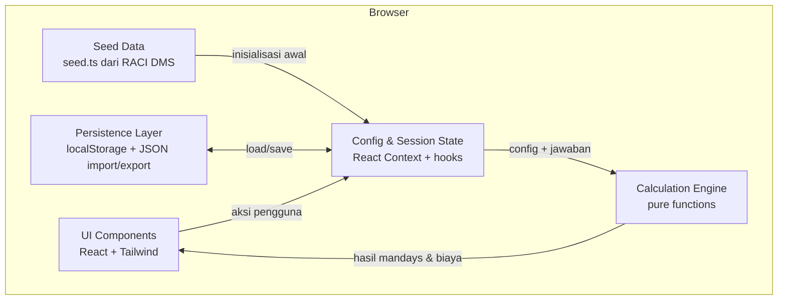

# Arsitektur — Mandays Generator

Dokumen ini menjelaskan arsitektur aplikasi Mandays Generator secara ringkas. Untuk cara setup, run, dan deploy, lihat [README.md](./README.md).

## Ringkasan

Mandays Generator adalah aplikasi web **client-side** (berjalan sepenuhnya di browser) yang membantu Solution Architect menyusun estimasi mandays sebuah project. Tidak ada backend, tidak ada database, dan tidak ada API server. Seluruh state disimpan di memori browser dan dipersist ke `localStorage`, serta dapat di-import/export sebagai file JSON.

Stack: **Next.js (App Router) + React + TypeScript + Tailwind CSS**. Karena state bersifat interaktif dan mengakses `localStorage`, seluruh komponen adalah *client component*.

## Diagram Arsitektur

## Komponen Utama

- **UI Components (`app/`, `components/`)**
  Lapisan tampilan berbasis React + Tailwind. Dua area besar: mode **Estimasi** (stepper: Pilih Task → Kuisioner → Hasil) dan mode **Konfigurasi** yang terbagi menjadi empat sub-tab: **Task**, **Kuisioner**, **Rate** (mengatur rate default persisted), dan **Import/Export**. Komponen kunci: `TaskSelector`, `Questionnaire`, `ResultsTable` (menampilkan kolom **biaya per role** = mandays role × rate efektif), `ExportCsvButton` (berada di **bar navigasi** langkah Hasil, menggantikan tombol "Lanjut"), `RatePanel` (dipakai di sub-tab Rate untuk default dan di langkah Hasil untuk override sesi + tombol "Reset ke rate default"), `ConfigEditor`, `QuestionEditor` (mendukung reorder pertanyaan ↑/↓), `ImportExportPanel`. Untuk gerbang peran: `AdminGate` (form buat-password first-run / login yang dirender `AppShell` menggantikan `ConfigEditor` saat bukan admin) dan `ChangePasswordPanel` (ganti password, hanya tampil untuk admin, disisipkan di `ImportExportPanel`). `AppShell` juga menampilkan indikator peran & tombol Logout di header.

- **Config & Session State (`context/ConfigContext.tsx`)**
  Menyediakan state global via React Context, dengan pemisahan penting:
  - **Config (persisted):** definisi kategori, task, variabel, tier, pertanyaan kuisioner, dan `config.rates` (rate **default** persisted). Ini adalah aktivitas "admin" dan dipersist ke `localStorage`.
  - **Session (ephemeral):** `selectedTaskIds` (task yang dipilih), `answers` (jawaban kuisioner), dan `rateOverrides` (override rate untuk sesi estimasi saat ini). Ini adalah aktivitas "estimasi" dan hidup di memori — `rateOverrides` tidak dipersist dan dapat dikosongkan lewat "Reset ke rate default".
  - **Auth (ephemeral):** `role` (`"user"` | `"admin"`, default `"user"`), `isAdminConfigured`, dan `envAuthMode`. Peran adalah gerbang UI client-side dan **tidak dipersist** — reload selalu kembali ke General User. Fungsi `loginAdmin`, `logoutAdmin`, `createAdminPassword`, `changeAdminPassword`, dan `resetAdminPassword` diekspos lewat hook `useAuth`, yang mendelegasikan operasi hashing/storage ke `lib/auth.ts`. `isAdminConfigured` dan `envAuthMode` awalnya `false` (agar render server & client pertama identik) lalu dihitung setelah mount (dari `isAdminConfigured()`/`isEnvAuthMode()`), mirip pola `loadConfig`. Bila `envAuthMode` true, UI (`AdminGate`, `ChangePasswordPanel`) menyembunyikan alur buat-password/ganti/reset dan hanya menampilkan Login.

- **Calculation Engine (`lib/calc.ts`)**
  Kumpulan fungsi murni (tanpa efek samping) yang menghitung hasil dari `config` + `selectedTaskIds` + `answers` + `rateOverrides`. Menghasilkan mandays per task, agregasi per kategori-per-level, total per level, grand total, serta biaya. Biaya dihitung memakai **rate efektif** per level = `rateOverrides ?? config.rates ?? 0` (override sesi bila ada, selain itu rate default konfigurasi, selain itu 0). Karena murni, engine ini mudah diuji dan reaktif.

- **Persistence Layer (`lib/persistence.ts`, `lib/validation.ts`)**
  Menangani load/save `localStorage`, Export JSON (unduh), Import JSON (dengan validasi skema), dan Reset ke seed. Import yang tidak valid ditolak tanpa merusak state aktif. Bila `localStorage` tidak tersedia (mode privat), aplikasi tetap jalan dengan state memori. Helper `downloadText` di modul ini dipakai untuk memicu unduhan file, baik untuk JSON konfigurasi maupun CSV hasil estimasi.

- **CSV Module (`lib/csv.ts`)**
  Kumpulan fungsi murni yang membangun string CSV dari `EstimationResult` + `AppConfig`. Menghasilkan matriks task × level dengan penomoran kategori (A, B, C...) dan task per kategori (A.1, A.2...), menyebar mandays tiap role ke kolom level yang sesuai, serta menambahkan baris "Grand Total" per level. Karena murni, mudah diuji dan tidak menyentuh DOM — unduhan dilakukan lewat `downloadText`.

- **Seed Data (`lib/seed.ts`)**
  Data awal berisi 7 kategori dan 71 task hasil ekstraksi dari referensi RACI DMS; tiap task berisi satu atau lebih role dengan `baselineMandays` dan `level` masing-masing. Dipakai saat `localStorage` kosong atau saat pengguna melakukan Reset. Seluruh nilai dapat diubah pengguna tanpa mengubah kode.

## Alur Data Utama

1. **Inisialisasi.** Saat mount, Persistence Layer mencoba load config dari `localStorage`. Jika kosong/tidak valid, aplikasi memakai Seed Data.
2. **Input pengguna.** Pengguna memilih task dan mengisi kuisioner → tersimpan di Session State (terpisah dari Config).
3. **Perhitungan reaktif.** Setiap perubahan `selectedTaskIds`, `answers`, atau `rates` memicu Calculation Engine menghitung ulang hasil (via `useMemo`).
4. **Tampilan hasil.** UI menampilkan mandays per task/kategori/total dan biaya opsional.
5. **Persistensi.** Perubahan pada Config otomatis di-persist ke `localStorage`; config juga dapat di-export/import sebagai JSON.

## Model Data (ringkas)

Konfigurasi disusun sebagai `AppConfig` yang menjadi bentuk file export/import:

- `Category` → berisi banyak `Task`.
- `Task` → punya daftar `roles` (minimal 1 role).
- `TaskRole` → punya `level`, `baselineMandays`, dan opsional `variable` (tier sendiri per role). Satu task bisa melibatkan beberapa role sekaligus; mandays dijumlahkan lintas role.
- `TaskVariable` → mengacu ke sebuah `Question` dan punya daftar `Tier`.
- `Tier` → menentukan `mandays` dan opsional `levelShift` (menggeser level role tersebut, bukan level task).
- `Question` → pertanyaan kuisioner di level kategori (`numeric` atau `single_choice`).
- `RateTable` → rate opsional per level staff untuk estimasi biaya.

Satu pertanyaan (level kategori) bisa direferensikan beberapa task, sehingga satu jawaban dapat memengaruhi banyak task sekaligus.

> **Versi skema config = 2.** Ini adalah *breaking change* (model role per task menggantikan model lama 1 task = 1 level). Config lama (versi < 2) tidak kompatibel; saat terdeteksi, aplikasi fallback ke seed data.

## Keputusan Arsitektur Utama (selaras prinsip MVP)

- **Tanpa infrastruktur.** Tanpa DB/API — memenuhi kebutuhan pilot dengan biaya operasional minimal dan deploy sederhana ke Vercel.
- **Data-driven.** Kategori, task, dan kuisioner sepenuhnya berbasis konfigurasi, sehingga aplikasi bisa dipakai untuk project non-DMS tanpa ubah kode.
- **Perhitungan deterministik.** Engine berupa fungsi murni agar hasil konsisten dan mudah diuji.
- **State minimal.** Cukup React Context + hooks; tidak memakai library state eksternal.

- **Auth Layer (`lib/auth.ts`)**
  Modul fungsi murni + akses `localStorage` yang di-guard (mengikuti pola `persistence.ts`) untuk gerbang admin. Mendukung **dua mode sumber password** yang dipilih otomatis:
  - **MODE ENV** — aktif bila env var `NEXT_PUBLIC_ADMIN_AUTH` ada & valid (format `"<saltHex>:<hashHex>"`, keduanya hex non-kosong). Password menjadi **global & konsisten di semua browser** (incognito/device lain sama). Sumber kebenaran = env var. `isAdminConfigured()` selalu `true`; `verifyAdminPassword()` menghitung `SHA-256(saltEnv + password)` lalu membandingkan constant-time dengan hash env. Fungsi `setAdminPassword`/`changeAdminPassword`/`clearAdminPassword` menjadi **no-op aman** (berturut-turut: resolve tanpa menulis, `return false`, no-op) karena password dikelola lewat env var + redeploy. Helper: `parseEnvAuth(raw)` (fungsi murni, mudah dites), `getEnvAuth()` (membaca `process.env.NEXT_PUBLIC_ADMIN_AUTH`), dan `isEnvAuthMode()`.
  - **MODE LOCAL** — aktif bila env var tidak diset (perilaku lama). Menyimpan record auth pada key **terpisah** `mandays-generator:admin-auth` dengan bentuk `{ version, salt, hash, algo: "SHA-256" }`. Password **tidak pernah** disimpan plaintext — hanya salt acak (`crypto.getRandomValues`) + `hash = SHA-256(salt + password)` via Web Crypto (`crypto.subtle`). Alur first-run buat-password, ganti, dan reset (lupa password) berlaku penuh, tetapi bersifat per-browser.

  Fungsi publik: `isAdminConfigured`, `setAdminPassword`, `verifyAdminPassword` (perbandingan constant-time sederhana), `changeAdminPassword`, `clearAdminPassword`, plus helper mode ENV di atas. Semua akses `window`/`crypto`/`process` di-guard agar aman saat SSR/Node; bila Web Crypto tidak tersedia, fungsi async gagal dengan aman. Nilai `salt:hash` untuk MODE ENV dibuat lewat skrip `scripts/gen-admin-hash.mjs` (Node ESM tanpa dependency) yang memakai algoritma hashing **identik** dengan `hashPassword` di modul ini.

## Peran & Keamanan (gate client-side)

Aplikasi membedakan **General User** (default) dan **Admin** melalui gerbang UI. General User hanya mengakses Estimasi; mode Konfigurasi memerlukan login admin.

Sumber password admin dipilih otomatis oleh dua mode:
- **MODE ENV** (env var `NEXT_PUBLIC_ADMIN_AUTH` diset): password **global & konsisten** di semua browser/device/incognito. Gerbang selalu menampilkan Login; buat-password/ganti/reset tidak berlaku dari UI (dikelola via env var + redeploy). Nilai env var dibuat dengan `scripts/gen-admin-hash.mjs` dan berformat `salt:hash` (hash, bukan plaintext).
- **MODE LOCAL** (default, tanpa env var): alur first-run memaksa admin membuat password sendiri (tidak ada password default hardcoded), dengan opsi ganti password dan reset darurat (lupa password) yang **tidak menghapus konfigurasi** (key `localStorage` berbeda). Password bersifat **per-browser** — incognito/device lain akan diminta membuat password lagi.

> **Batasan penting.** Ini adalah **gerbang UI praktis untuk pilot, bukan keamanan sungguhan**. Aplikasi sepenuhnya client-side, sehingga siapa pun yang teknis dapat membuka `localStorage`/DevTools dan melihat record auth (salt + hash) atau melewati gate dengan memanipulasi state. Di MODE LOCAL yang disimpan hanyalah **salt + hash SHA-256** (bukan plaintext) dan record ini **tidak ikut Export JSON** konfigurasi. Di MODE ENV, nilai `NEXT_PUBLIC_ADMIN_AUTH` **ter-embed di bundle** client — sesuai sifat prefix `NEXT_PUBLIC_` — sehingga yang di-embed pun **hash**, bukan password asli; hash tetap terlihat bagi yang teknis. Untuk keamanan sebenarnya (mencegah penyerang, bukan sekadar akses tak sengaja) diperlukan autentikasi berbasis backend — di luar cakupan pilot ini.

## Kredensial

Tidak ada credential **plaintext** yang di-hardcode di kode maupun dokumentasi, dan tidak ada password default. Deploy ke Vercel **tidak memerlukan** environment variable; namun env var **opsional** `NEXT_PUBLIC_ADMIN_AUTH` dapat diset untuk mengaktifkan MODE ENV (password admin global). Nilainya berformat `salt:hash` (bukan password asli) yang dibuat lewat `scripts/gen-admin-hash.mjs`. Di MODE LOCAL, seluruh data pengguna (termasuk record auth) tersimpan lokal di browser masing-masing (`localStorage`) dan tidak dikirim ke server mana pun; di MODE ENV, hash ter-embed di bundle client saat build.
